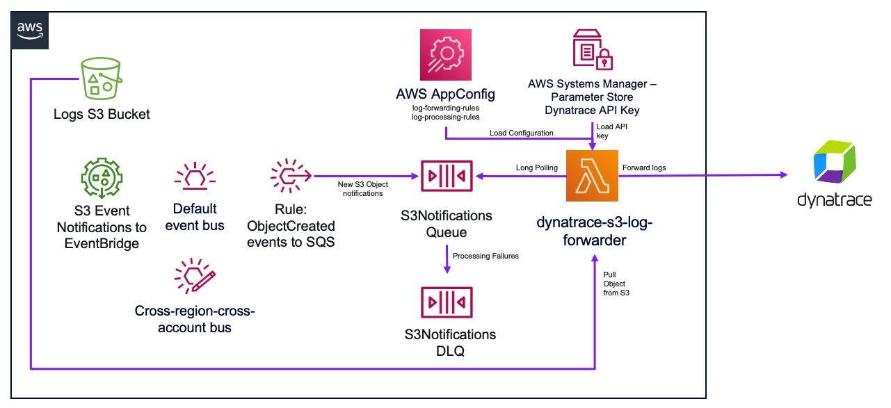
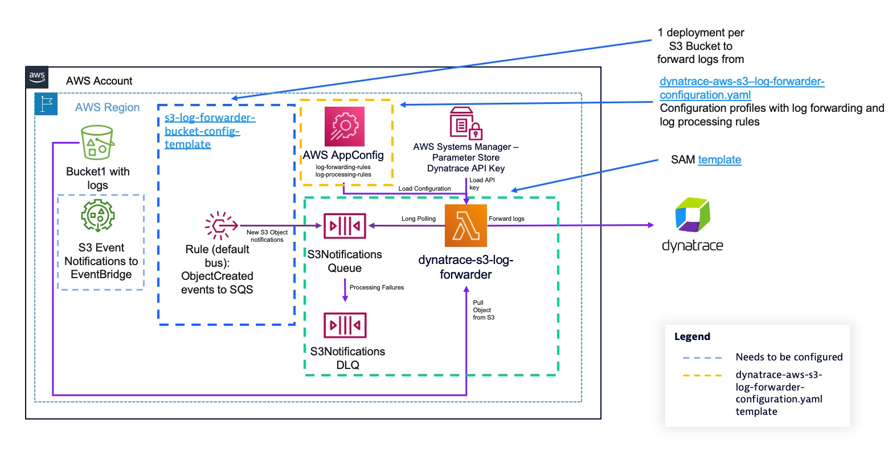

# dynatrace-aws-s3-log-forwarder

This project deploys a Serverless architecture to forward logs from Amazon S3 to Dynatrace.



## Supported AWS Services

The `dynatrace-aws-s3-log-forwarder` supports out-of-the-box parsing and forwarding of logs for the following AWS Services:

* AWS Elastic Load Balancing access logs ([ALB](https://docs.aws.amazon.com/elasticloadbalancing/latest/application/load-balancer-access-logs.html), [NLB](https://docs.aws.amazon.com/elasticloadbalancing/latest/network/load-balancer-access-logs.html) and [Classic ELB](https://docs.aws.amazon.com/elasticloadbalancing/latest/classic/access-log-collection.html))
* [Amazon CloudFront](https://docs.aws.amazon.com/AmazonCloudFront/latest/DeveloperGuide/AccessLogs.html) access logs
* [AWS CloudTrail](https://docs.aws.amazon.com/awscloudtrail/latest/userguide/cloudtrail-log-file-examples.html) logs
* [AWS Global Accelerator](https://docs.aws.amazon.com/global-accelerator/latest/dg/monitoring-global-accelerator.flow-logs.html) Flow logs
* [Amazon Managed Streaming for Kafka](https://docs.aws.amazon.com/msk/latest/developerguide/msk-logging.html) logs
* [AWS Network Firewall](https://docs.aws.amazon.com/network-firewall/latest/developerguide/logging-s3.html) alert and flow logs
* [Amazon Redshift](https://docs.aws.amazon.com/redshift/latest/mgmt/db-auditing.html#db-auditing-manage-log-files) audit logs
* [Amazon S3 access logs](https://docs.aws.amazon.com/AmazonS3/latest/userguide/ServerLogs.html)
* [Amazon VPC DNS query logs](https://docs.aws.amazon.com/Route53/latest/DeveloperGuide/resolver-query-logs.html)
* [Amazon VPC Flow logs](https://docs.aws.amazon.com/vpc/latest/userguide/flow-logs-s3.html) (default logs)
* [AWS WAF](https://docs.aws.amazon.com/waf/latest/developerguide/logging-s3.html) logs

Additionally, you can ingest any generic text and JSON logs. For more information, visit [docs/log_forwarding.md](docs/log_forwarding.md).

## Deployment instructions

### Prerequisites

The deployment instructions are written for Linux/MacOS. If you are running on Windows, use the Linux Subsystem for Windows or use an [AWS Cloud9](https://aws.amazon.com/cloud9/) instance.

You'll need the following software installed:

* [AWS CLI](https://docs.aws.amazon.com/cli/latest/userguide/getting-started-install.html)
* Docker Engine

You'll also need:

* A [Dynatrace access token](https://www.dynatrace.com/support/help/dynatrace-api/basics/dynatrace-api-authentication) for your tenant with the `logs.ingest` APIv2 scope.

### Deploy the dynatrace-aws-s3-log-forwarder

The deployment of the log forwarder is split into multiple CloudFormation templates. To get a high level view of what's deployed by which template, look at the diagram below:



The AWS Lambda function that performs log forwarding is built as a container image. Starting on `v0.3.1` container images are built and released to the `dynatrace-oss` Amazon ECR public registry [here](https://gallery.ecr.aws/dynatrace-oss/dynatrace-aws-s3-log-forwarder) to facilitate the deployment. If you want to build your own container images, go to the [docs/build.md](docs/build.md) documentation.

To deploy the `dynatrace-aws-s3-log-forwarder` using the provided container images, follow the instructions below:

1. Define a name for your `dynatrace-aws-s3-log-forwarder` deployment (e.g. mycompany-dynatrace-s3-log-forwarder) and your dynatrace tenant UUID (e.g. `abc12345` if your Dynatrace environment url is `https://abc12345.live.dynatrace.com`) in environment variables that will be used along the deployment process.

    ```bash
    export STACK_NAME=replace_with_your_log_forwarder_stack_name
    export DYNATRACE_TENANT_UUID=replace_with_your_dynatrace_tenant_uuid
    ```

    > **Important**
    > Your stack name should have a maximum of 54 characters, otherwise deployment will fail.

1. Create an AWS SSM SecureString Parameter to store your Dynatrace access token to ingest logs.

    ```bash
    export PARAMETER_NAME="/dynatrace/s3-log-forwarder/$STACK_NAME/$DYNATRACE_TENANT_UUID/api-key"
    # Configure HISTCONTROL to avoid storing on the bash history the commands containing API keys
    export HISTCONTROL=ignorespace
     export PARAMETER_VALUE=your_dynatrace_api_key_here
     aws ssm put-parameter --name $PARAMETER_NAME --type SecureString --value $PARAMETER_VALUE
    ```

    > **Notes**
    >
    > * HISTCONTROL is set here to avoid storing commands starting with a space on bash history.
    > * It's important that your parameter name follows the structure above, as the solution grants permissions to AWS Lambda to the hierarchy `/dynatrace/s3-log-forwarder/ your_stack_name/*`
    > * Your API Key is stored encyrpted with the default AWS-managed key alias: `aws/ssm`. If you want to use a Customer-managed Key, you'll need to grant Decrypt permissions > to the AWS Lambda IAM Role that's deployed within the CloudFormation template.

1. Create an Amazon ECR repository on your AWS account.

    ```bash
    aws ecr create-repository --repository-name dynatrace-aws-s3-log-forwarder
    ```

1. Pull the dynatrace-aws-s3-log-forwarder image from the Amazon ECR Public repository and push it to your private ECR repository, so it can be used by Lambda to deploy the function.

    ```bash
    # Get the latest version
    export VERSION_TAG=$(curl -s https://api.github.com/repos/dynatrace-oss/dynatrace-aws-s3-log-forwarder/releases/latest | grep tag_name | cut -d'"' -f4)
    # Get private repo URI
    export REPOSITORY_URI=$(aws ecr describe-repositories --repository-names dynatrace-aws-s3-log-forwarder --query 'repositories[0].repositoryUri' --output text)

    # Pull the image
    docker pull public.ecr.aws/dynatrace-oss/dynatrace-aws-s3-log-forwarder:${VERSION_TAG}-x86_64
    docker tag public.ecr.aws/dynatrace-oss/dynatrace-aws-s3-log-forwarder:${VERSION_TAG}-x86_64 ${REPOSITORY_URI}:${VERSION_TAG}-x86_64

    # ECR login and push image
    aws ecr get-login-password --region us-east-1 | docker login --username AWS --password-stdin $(echo "$REPOSITORY_URI" | cut -d'/' -f1)
    docker push ${REPOSITORY_URI}:${VERSION_TAG}-x86_64
    ```

1. Download the CloudFormation templates for the latest version:

    ```bash
    mkdir dynatrace-aws-s3-log-forwarder-templates && cd "$_"
    wget https://dynatrace-aws-s3-log-forwarder-assets.s3.amazonaws.com/${VERSION_TAG}/templates.zip
    unzip templates.zip
    ```

1. Execute the following command to deploy the `dynatrace-aws-s3-log-forwarder`:

    ```bash
    aws cloudformation deploy --stack-name ${STACK_NAME} --parameter-overrides \
                DynatraceEnvironment1URL="https://$DYNATRACE_TENANT_UUID.live.dynatrace.com" \
                DynatraceEnvironment1ApiKeyParameter=$PARAMETER_NAME \
                ContainerImageUri=${REPOSITORY_URI}:${VERSION_TAG}-x86_64 \
                --template-file template.yaml --capabilities CAPABILITY_IAM 
    ```

    If successfull, you'll see the a message similar to the below at the end of the execution:

    ```bash
    Successfully created/updated stack - dynatrace-s3-log-forwarder in us-east-1
    ```

    > **Notes**
    >
    > * You can optionally configure notifications on your e-mail address to receive alerts when log files can't be processed and messages are arriving to the Dead Letter Queue. To do so, add the parameter `NotificationsEmail`=`your_email_address_here`.
    > * An Amazon SNS topic is created to receive monitoring alerts where you can subscribe HTTP endpoints to send the notification to your tools (e.g. PagerDuty, Service  Now...).
    > * If you plan to forward logs from Amazon S3 buckets in different AWS accounts and regions that where you're deploying the log forwarder, add the parmeters `EnableCrossRegionCrossAccountForwarding`=`true` and optionally `AwsAccountsToReceiveLogsFrom`=`012345678912,987654321098` to the above command. (You can enable this at a later stage, re-running the command above with the mentioned parameters). For more detailed information look at the [docs/log_forwarding](docs/log_forwarding. md#forward-logs-from-s3-buckets-on-different-aws-regions) documentation.
    > * The template is deployed with a pre-defined set of default values to suit the majority of use cases. If you want to customize deployment values, you can find the parameter descriptions on the [template.yaml](template.yaml#L29-L152) file. You'll find more information on the [docs/advanced_deployments](docs/advanced_deployments.md) documentation.
    > * To ingest logs into a Dynatrace Managed environment, the `DynatraceEnvironment1URL` parameter should be formatted like this: `https://{your-activegate-domain}:9999/e/{your-environment-id}`. Unless your environment Active Gate are public-facing, you'll need to configure Lambda to run on an Amazon VPC from where your Active Gate can be reached adding the parameters `LambdaSubnetIds` with the list of subnets where Lambda can run (for high availability, select at least 2 in different Availability Zones) and `LambdaSecurityGroupId` with the security group assigned to your Lambda function. The subnets where the Lambda function runs should allow outbound connectivity to the internet. For more details, check the [AWS Lambda documentation](https://docs.aws.amazon.com/lambda/latest/dg/configuration-vpc.htm). If your Active Gate uses a self-signed SSL certificate, set the parameter `VerifyLogEndpointSSLCerts` to `false`.

1. The log forwarding Lambda function pulls configuration data from AWS AppConfig that contains the rules that defines how to forward and process log files. The `dynatrace-aws-s3-log-forwarder-configuration.yaml` CloudFormation template is designed to help get you started deploying the log forwarding configuration. It deploys a default "catch all" log forwarding rule that makes the log forwarding Lambda function process any S3 Object it receives an S3 Object Created notification for, and attempts to identify the source of the log, matching the object against supported AWS log sources. The log forwarder logic falls back to generic text log ingestion if it's unable to identify the log source:

    ```yaml
    ---
    bucket_name: default
    log_forwarding_rules:
      - name: default_forward_all
        # Match any file in your buckets
        prefix: ".*"
        # Process as AWS-vended log (automatic fallback to generic text log    ingestion if log is not 
        source: aws
    ```

    You'll find this rule defined in-line on the CloudFormation template [here](dynatrace-aws-s3-log-forwarder-configuration.yaml#L60-L67), which you can modify and tailor it to your needs. To configure explicit log forwarding rules, visit  the [docs/log_forwarding.md](docs/log_forwarding.md) documentation.

    To deploy the configuration, execute the following command:

    ```bash
    aws cloudformation deploy \
        --template-file dynatrace-aws-s3-log-forwarder-configuration.yaml \
        --stack-name dynatrace-aws-s3-log-forwarder-configuration-$STACK_NAME \
        --parameter-overrides DynatraceAwsS3LogForwarderStackName=$STACK_NAME
    ```

    > **Notes**
    >
    > * You can deploy updated configurations at any point in time, the log forwarding function will load them in ~1 minute after they've been deployed.
    > * The log forwarder adds context attributes to all forwarded logs, including: `log.source.aws.s3.bucket.name`, `log.source.aws.s3.key.name` and `cloud.forwarder`. Additional attributes are extracted from log contents for supported AWS-vended logs.

1. At this point, you have successfully deployed the `dynatrace-aws-s3-log-forwarder` with your desired configuration. Now, you need to configure specific Amazon S3 buckets to send "S3 Object created" notifications to the log forwarder; as well as grant permissions to the log forwarder to read files from your bucket. For each bucket that you want to send logs from to Dynatrace, perform the below steps:

    * Go to your S3 bucket(s) configuration and enable S3 notifications via EventBridge following instructions [here](https://docs.aws.amazon.com/AmazonS3/latest/userguide/enable-event-notifications-eventbridge.html).
    * Create Amazon EventBridge rules to send Object created notifications to the log forwarder. To do so, deploy the `dynatrace-aws-s3-log-forwarder-s3-bucket-configuration.yaml` CloudFormation template:

        ```bash
        export BUCKET_NAME=your-bucket-name-here

        aws cloudformation deploy \
            --template-file dynatrace-aws-s3-log-forwarder-s3-bucket-configuration.yaml \
            --stack-name dynatrace-aws-s3-log-forwarder-s3-bucket-configuration-$BUCKET_NAME \
            --parameter-overrides DynatraceAwsS3LogForwarderStackName=$STACK_NAME \
                                  LogsBucketName=$BUCKET_NAME \
            --capabilities CAPABILITY_IAM
        ```

        > **Notes**
        >
        > * The S3 bucket must be on the same AWS account and region than where your log forwarder is deployed. For cross-region and cross-account deployments, check the [docs/log_forwarding.md](docs/log_forwarding.md#forward-logs-from-s3-buckets-on-different-aws-regions) docs.
        > * If you want to forward logs only for specific S3 prefixes, you can add up to 10 LogsBucketPrefix# parameter overrides (e.g. LogsBucketPrefix1=dev/ LogsBucketPrefix2=prod/ ...)
        > * If your logs on S3 are SSE-KMS encrypted with a customer-managed KMS key, you need to grant `kms:Decrypt` permissions to the IAM role used by the AWS Lambda function forwarding logs so it can download the logs. You can find the IAM role name on the CloudFormation outputs of the log forwarder stack. For more information, check the AWS KMS [documentation](https://docs.aws.amazon.com/kms/latest/developerguide/control-access.html).
        >
        >    ```bash
        >    aws cloudformation describe-stacks --stack-name $STACK_NAME --query 'Stacks[].Outputs[?OutputKey==`QueueProcessingFunctionIamRole`].OutputValue' --output text
        >    ```

### Next steps

At this stage, you should see logs being ingested in Dynatrace as they're written to Amazon S3. For more detailed information and advanced configuration details, visit the documentation in the `docs` folder.
