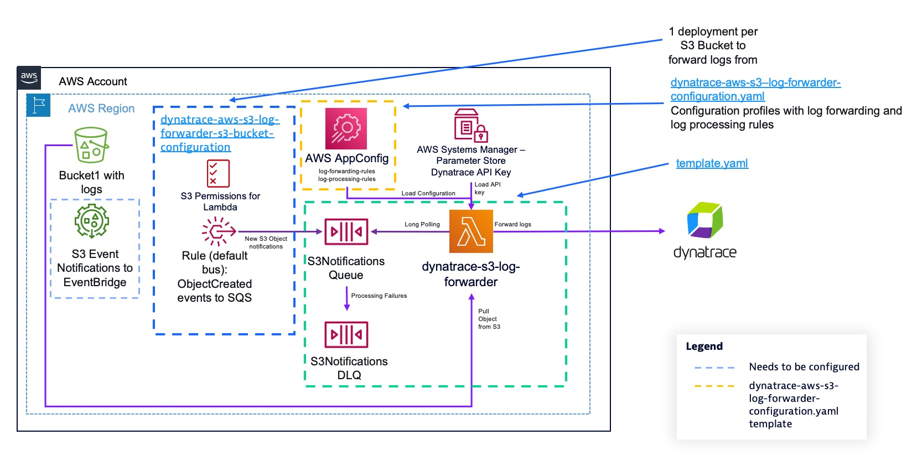

# dynatrace-aws-s3-log-forwarder

This project deploys a Serverless architecture to forward logs from Amazon S3 to Dynatrace.

> **Note**
> This product is not officially supported by Dynatrace but maintained on a best effort basis


## Deployment instructions

### Prerequisites

The deployment instructions are written for Linux/MacOS. If you are running on Windows, use the Linux Subsystem for Windows or use an [AWS Cloud9](https://aws.amazon.com/cloud9/) instance.

You'll need the following software installed:

* [AWS CLI](https://docs.aws.amazon.com/cli/latest/userguide/getting-started-install.html)
* [AWS SAM CLI](https://docs.aws.amazon.com/serverless-application-model/latest/developerguide/serverless-sam-cli-install.html)
* Docker Engine
* Git

You'll also need:

* A [Dynatrace access token](https://www.dynatrace.com/support/help/dynatrace-api/basics/dynatrace-api-authentication) for your tenant with the `logs.ingest` APIv2 scope.

### Deploy the dynatrace-aws-s3-log-forwarder

The deployment of the log forwarder is split into multiple SAM/CloudFormation templates. To get a high level view of what's deployed by which template, look at the diagram below:



To deploy the solution, follow the instructions below:

1. Download required dependencies (AWS Lambda Extensions) to build the log forwarder container image:

    ```bash
    bash get-required-lambda-layers.sh
    ```

1. Clone the `dynatrace-aws-s3-log-forwarder` repository and checkout the latest version tag:

    ```bash
    export VERSION_TAG=$(curl -s https://api.github.com/repos/dynatrace-oss/dynatrace-aws-s3-log-forwarder/releases/latest | grep tag_name | cut -d'"' -f4)
    git clone https://github.com/dynatrace-oss/dynatrace-aws-s3-log-forwarder.git
    cd dynatrace-aws-s3-log-forwarder
    git checkout $VERSION_TAG
    ```

1. Define a name for your `dynatrace-aws-s3-log-forwarder` deployment (e.g. mycompany-dynatrace-s3-log-forwarder) and your dynatrace tenant UUID (e.g. `abc12345` if your Dynatrace environment url is `https://abc12345.live.dynatrace.com`) in environment variables that will be used along the deployment process.

    ```bash
    export STACK_NAME=replace_with_your_log_forwarder_stack_name
    export DYNATRACE_TENANT_UUID=replace_with_your_dynatrace_tenant_uuid
    ```

1. Create an AWS SSM SecureString Parameter to store your Dynatrace access token to ingest logs.

    ```bash
    export PARAMETER_NAME="/dynatrace/s3-log-forwarder/$STACK_NAME/$DYNATRACE_TENANT_UUID/api-key"
    # Configure HISTCONTROL to avoid storing on the bash history the commands containing API keys
    export HISTCONTROL=ignorespace
     export PARAMETER_VALUE=your_dynatrace_api_key_here
     aws ssm put-parameter --name $PARAMETER_NAME --type SecureString --value $PARAMETER_VALUE
    ```

    **NOTES:**
    * It's important that your parameter name follows the structure above, as the solution grants access to AWS Lambda permissions to the hierarchy `/dynatrace/s3-log-forwarder/your_stack_name/*`
    * Your API Key is stored encyrpted with the default AWS-managed key alias: `aws/ssm`. If you want to use a Customer-managed Key, you'll need to grant Decrypt permissions to the AWS Lambda IAM Role that's deployed within the SAM template.

1. From the project root directory, execute the following command to build the Serverless application:

    ```bash
    sam build 
    ```

    **NOTE:** We are using a container image to build the AWS Lambda function. By default, we set the processor architecture to x86_64. If you want to build an arm64, you can use the `ProcessorArchitecture` parameter.

    ```bash
    sam build --parameter-overrides \
            ProcessorArchitecture=arm64
    ```

1. Execute the following command to deploy the `dynatrace-aws-s3-log-forwarder` with default settings.

    ```bash
    sam deploy --parameter-overrides \
            DynatraceEnvironment1URL="https://$DYNATRACE_TENANT_UUID.live.dynatrace.com" \
            DynatraceEnvironment1ApiKeyParameter=$PARAMETER_NAME \
            NotificationsEmail="your_email@example.com" 
    ```

    If successfull, you'll see the a message similar to the below at the end of the execution:

    ```bash
    Successfully created/updated stack - dynatrace-s3-log-forwarder in us-east-1
    ```

    **NOTES:**
    * The e-mail address is set to receive alerts when log files can't be processed and messages are arriving to the Dead Letter Queue. If you don't want to receive those, just remove the parameter.
    * An Amazon SNS topic is created to receive monitoring alerts where you can subscribe HTTP endpoints to send the notification to your tools (e.g. PagerDuty, Service Now...).
    * If you want to configure advanced settings you can execute the commmand `sam deploy --guided` and you'll be prompted for all the possible configuration parameters.

1. The log forwarding Lambda function pulls configuration data from AWS AppConfig that contains the rules that defines how to forward and process log files. The `dynatrace-aws-s3-log-forwarder-configuration.yaml` is designed to help get you started. It deploys a default "catch all" log forwarding rule that makes the log forwarding Lambda function process any S3 Object it receives an S3 Object Created notification for, and attempts to identify the source of the log, matching the object against supported AWS log sources. The rule falls back to generic text log ingestion if it's unable to identify the log source:

    ```yaml
    ---
    bucket_name: default
    log_forwarding_rules:
      - name: default_forward_all
        # Match any file in your buckets
        prefix: ".*"
        # Process as AWS-vended log (automatic fallback to generic text log    ingestion if log is not 
        source: aws
    ```

    You'll find this rule defined in-line on the CloudFormation template [here](dynatrace-aws-s3-log-forwarder-configuration.yaml#L60-L67), which you can modify to tailor it to your needs. To configure explicit log forwarding rules, look at the [docs/log_forwarding.md](docs/log_forwarding.md) documentation.

    To deploy the configuration, execute the following command:

    ```bash
    aws cloudformation deploy \
        --template-file dynatrace-aws-s3-log-forwarder-configuration.yaml \
        --stack-name dynatrace-aws-s3-log-forwarder-configuration-$STACK_NAME \
        --parameter-overrides DynatraceAwsS3LogForwarderStackName=$STACK_NAME
    ```

    **NOTES:**
    * You can deploy updated configurations at any point in time, the log forwarding function will load them in ~1 minute after they've been deployed.
    * The log forwarder adds context attributes to all forwarded logs, including: `log.source.s3_bucket`, `log.source.s3_key_name` and `log.source.forwarder`. Additional attributes are extracted from log contents for supported AWS-vended logs.

1. At this point, you have successfully deployed the `dynatrace-aws-s3-log-forwarder` with your desired configuration. Now, you need to configure specific Amazon S3 buckets to send "S3 Object created" notifications to the log forwarder; as well as grant permissions to the log forwarder to read files from your bucket. For each bucket that you want to send logs from to Dynatrace, perform the below steps:

    * Go to your S3 bucket(s) configuration and enable S3 notifications via EventBridge following instructions [here](https://docs.aws.amazon.com/AmazonS3/latest/userguide/enable-event-notifications-eventbridge.html).
    * Create Amazon EventBridge rules to send Object created notifications to the log forwarder. To do so, deploy the `s3-log-forwarder-bucket-config-template.yaml` CloudFormation template:

        ```bash
        export BUCKET_NAME=your-bucket-name-here

        aws cloudformation deploy \
            --template-file s3-log-forwarder-bucket-config-template.yaml \
            --stack-name    dynatrace-aws-s3-log-forwarder-s3-bucket-configuration-$BUCKET_NAME     \
            --parameter-overrides       DynatraceAwsS3LogForwarderStackName=$STACK_NAME \
                LogsBucketName=$BUCKET_NAME \
            --capabilities CAPABILITY_IAM
        ```

        **NOTES:**
        * The S3 bucket must be on the same AWS account and region than where your log forwarder is deployed. For cross-region and cross-account deployments, check the [docs/log_forwarding.md](docs/log_forwarding.md) docs.
        * If you want to forward logs only for specific S3 prefixes, you can add up to 10 LogsBucketPrefix# parameter overrides (e.g. LogsBucketPrefix1=dev/ LogsBucketPrefix2=prod/ ...)

### Next steps

At this stage, you should see logs being ingested in Dynatrace as they're written to Amazon S3. For more detailed information and advanced configuration details, visit the documentation in the `docs` folder.
