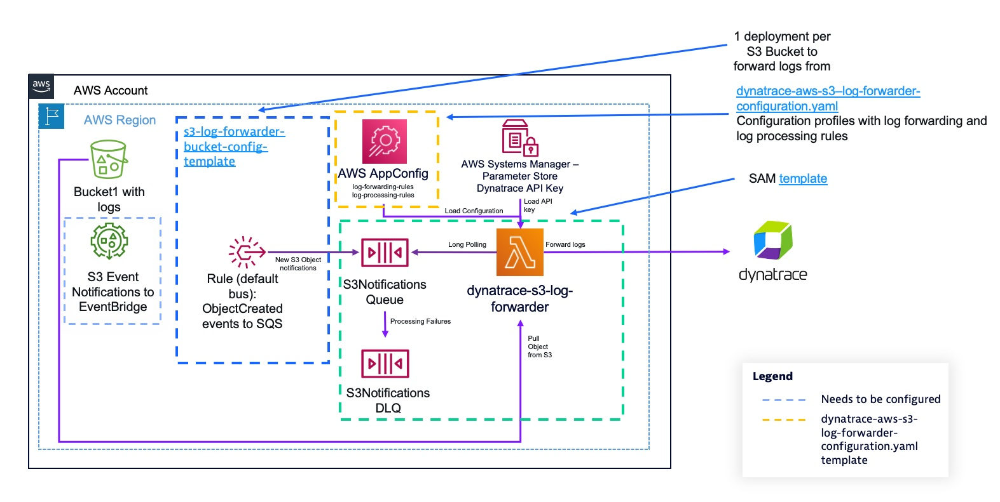

# Deployment instructions

## Prerequisites

The deployment instructions are written for Linux/MacOS. If you are running on Windows, use the Linux Subsystem for Windows, AWS CloudShell or an [AWS Cloud9](https://aws.amazon.com/cloud9/) instance.

You'll need the following software installed:

* [AWS CLI](https://docs.aws.amazon.com/cli/latest/userguide/getting-started-install.html)

You'll also need:

* A [Dynatrace access token](https://www.dynatrace.com/support/help/dynatrace-api/basics/dynatrace-api-authentication) for your tenant with the `logs.ingest` APIv2 scope.

## Deployment options

The `dynatrace-aws-s3-log-forwarder` supports two deployment package types:

| Option | Description |
|--------|-------------|
| **Lambda Layer** (default) | Use a Layer ARN provided by a maintainer (no build required) |
| **ZIP** | Lambda function code and dependencies packaged as a ZIP file |

## Deploy the dynatrace-aws-s3-log-forwarder

The deployment of the log forwarder is split into multiple CloudFormation templates. To get a high level view of what's deployed by which template, look at the diagram below:



### Step 1. Define a name for your `dynatrace-aws-s3-log-forwarder` deployment.

Define a name for your `dynatrace-aws-s3-log-forwarder` deployment (e.g. mycompany-dynatrace-s3-log-forwarder) and your Dynatrace tenant UUID (e.g. `abc12345` if your Dynatrace environment url is `https://abc12345.live.dynatrace.com`) in environment variables that will be used along the deployment process.

```bash
export STACK_NAME=<replace-with-your-log-forwarder-stack-name>
export DYNATRACE_TENANT_UUID=<replace-with-your-dynatrace-tenant-uuid>
```

> [!IMPORTANT]
>
> Your stack name should have a maximum of 53 characters, otherwise deployment will fail.

### Step 2. Create an AWS SSM SecureString Parameter to store your Dynatrace access token to ingest logs.

Execute the following command to create an AWS SSM Parameter Store SecureString parameter to store your Dynatrace access token. The log forwarder Lambda function retrieves the access token from this parameter at runtime.

```bash
export PARAMETER_NAME="/dynatrace/s3-log-forwarder/$STACK_NAME/$DYNATRACE_TENANT_UUID/api-key"
# Configure HISTCONTROL to avoid storing on the bash history the commands containing API keys
export HISTCONTROL=ignorespace
 export PARAMETER_VALUE=<your_dynatrace-access-token-here>
 aws ssm put-parameter --name $PARAMETER_NAME --type SecureString --value $PARAMETER_VALUE
```

> [!NOTE]
>
> * HISTCONTROL is set here to avoid storing commands starting with a space on bash history.
> * It's important that your parameter name follows the structure above, as the solution grants permissions to AWS Lambda to the hierarchy `/dynatrace/s3-log-forwarder/your-stack-name/*`
> * Your API Key is stored encyrpted with the default AWS-managed key alias: `aws/ssm`. If you want to use a Customer-managed Key, you'll need to grant Decrypt permissions to the AWS Lambda IAM Role that's deployed within the CloudFormation template.

### Step 3. Download the CloudFormation templates and Lambda package

Download the templates and pre-built Lambda ZIP for the latest release:

```bash
export VERSION_TAG=$(curl -s https://api.github.com/repos/dynatrace-oss/dynatrace-aws-s3-log-forwarder/releases/latest | grep tag_name | cut -d'"' -f4)
mkdir dynatrace-aws-s3-log-forwarder && cd "$_"
wget https://dynatrace-aws-s3-log-forwarder-assets.s3.amazonaws.com/${VERSION_TAG}/templates.zip
unzip templates.zip
```

### Step 4. Deploy the Lambda function

Choose one of the deployment options below:

---

#### Default option: Lambda Layer

This is the simplest option — no build tools, SAM CLI, or Python required.

1. Set the Layer ARN:

```bash
export LAYER_ARN=<layer-version-arn-provided-by-publisher>
```

1. Deploy the main forwarder stack:

```bash
aws cloudformation deploy \
    --stack-name ${STACK_NAME} \
    --template-file template.yaml \
    --capabilities CAPABILITY_IAM CAPABILITY_AUTO_EXPAND \
    --parameter-overrides \
        DynatraceEnvironment1URL="https://$DYNATRACE_TENANT_UUID.live.dynatrace.com" \
        DynatraceEnvironment1ApiKeyParameter=$PARAMETER_NAME \
        DeploymentPackageType="layer" \
        DynatraceS3LogForwarderLayerArn="$LAYER_ARN"
```

> **Note:** When the publisher releases a new layer version, update the `DynatraceS3LogForwarderLayerArn` parameter with the new ARN and redeploy the stack to pick up the update.

> [!IMPORTANT]
>
> If you deployed using the default Lambda Layer option above, continue directly to [Step 5. Deploy the log forwarding configuration](#step-5-deploy-the-log-forwarding-configuration).

---

#### Alternative option: ZIP deployment

1. Deploy the CloudFormation stack:

```bash
aws cloudformation deploy \
    --stack-name ${STACK_NAME} \
    --template-file template.yaml \
    --capabilities CAPABILITY_IAM CAPABILITY_AUTO_EXPAND \
    --parameter-overrides \
        DynatraceEnvironment1URL="https://$DYNATRACE_TENANT_UUID.live.dynatrace.com" \
        DynatraceEnvironment1ApiKeyParameter=$PARAMETER_NAME
```

1. Update the Lambda function code with the deployment package:

```bash
FUNCTION_NAME=$(aws cloudformation describe-stacks --stack-name ${STACK_NAME} \
    --query 'Stacks[0].Outputs[?OutputKey==`QueueProcessingFunction`].OutputValue' \
    --output text | rev | cut -d':' -f1 | rev)

aws lambda update-function-code --function-name ${FUNCTION_NAME} \
    --zip-file fileb://lambda.zip
```

If successfull, you'll see a message similar to the below at the end of the execution:

```json
{
    "FunctionName": "...",
    "LastUpdateStatus": "InProgress"
}
```

---

> [!NOTE]
>
> * You can optionally configure notifications on your e-mail address to receive alerts when log files can't be processed and messages are arriving to the Dead Letter Queue. To do so, add the parameter `NotificationsEmail`=`your_email_address_here`.
> * An Amazon SNS topic is created to receive monitoring alerts where you can subscribe HTTP endpoints to send the notification to your tools (e.g. PagerDuty, Service  Now...).
> * If you plan to forward logs from Amazon S3 buckets in different AWS accounts and regions that where you're deploying the log forwarder, add the parameters `EnableCrossRegionCrossAccountForwarding`=`true` and optionally `AwsAccountsToReceiveLogsFrom`=`012345678912,987654321098` to the above command. (You can enable this at a later stage, re-running the command above with the mentioned parameters). For more detailed information look at the [docs/log_forwarding](log_forwarding.md#forward-logs-from-s3-buckets-on-different-aws-regions) documentation.
> * The template is deployed with a pre-defined set of default values to suit the majority of use cases. If you want to customize deployment values, you can find the parameter descriptions on the [template.yaml](../template.yaml#L29-L152) file. You'll find more information on the [docs/advanced_deployments](advanced_deployments.md) documentation.
> * To ingest logs into a Dynatrace Managed environment, the `DynatraceEnvironment1URL` parameter should be formatted like this: `https://{your-activegate-domain}:9999/e/{your-environment-id}`. Unless your environment Active Gate is public-facing, you'll need to configure Lambda to run on an Amazon VPC from where your Active Gate can be reached adding the parameters `LambdaSubnetIds` with the list of subnets where Lambda can run (for high availability, select at least 2 in different Availability Zones) and `LambdaSecurityGroupId` with the security group assigned to your Lambda function. The subnets where the Lambda function runs should allow outbound connectivity to the Internet. For more details, check the [AWS Lambda documentation](https://docs.aws.amazon.com/lambda/latest/dg/configuration-vpc.htm). If your Active Gate uses a self-signed SSL certificate, set the parameter `VerifyLogEndpointSSLCerts` to `false`.
> * If ingesting logs into Dynatrace Managed environment, add the parameter `DynatraceLogIngestContentMaxLength`=`8192`, as it is default content length in Managed Dynatrace.

### Step 5. Deploy the log forwarding configuration.

The log forwarding Lambda function pulls configuration data from AWS AppConfig that contains the rules that defines how to forward and process log files. The `dynatrace-aws-s3-log-forwarder-configuration.yaml` CloudFormation template is designed to help get you started deploying the log forwarding configuration. It deploys a default "catch all" log forwarding rule that makes the log forwarding Lambda function process any S3 Object it receives an S3 Object Created notification for, and attempts to identify the source of the log, matching the object against supported AWS log sources. The log forwarder logic falls back to generic text log ingestion if it's unable to identify the log source:

```yaml
---
bucket_name: default
log_forwarding_rules:
  - name: default_forward_all
    # Match any file in your buckets
    prefix: ".*"
    # Process as AWS-vended log (automatic fallback to generic text log    ingestion if log is not
    source: aws
```

You'll find this rule defined in-line on the CloudFormation template [here](../dynatrace-aws-s3-log-forwarder-configuration.yaml#L60-L67), which you can modify and tailor it to your needs. To configure explicit log forwarding rules, visit  the [docs/log_forwarding.md](log_forwarding.md) documentation.

To deploy the configuration, execute the following command:

```bash
aws cloudformation deploy \
    --template-file dynatrace-aws-s3-log-forwarder-configuration.yaml \
    --stack-name dynatrace-aws-s3-log-forwarder-configuration-$STACK_NAME \
    --parameter-overrides DynatraceAwsS3LogForwarderStackName=$STACK_NAME
```

> [!NOTE]
>
> * You can deploy updated configurations at any point in time, the log forwarding function will load them in ~1 minute after they've been deployed.
> * The log forwarder adds context attributes to all forwarded logs, including: `log.source.aws.s3.bucket.name`, `log.source.aws.s3.key.name` and `cloud.forwarder`. Additional attributes are extracted from log contents for supported AWS-vended logs.

### Step 6. Configure S3 buckets to send "S3 Object created" notifications to the log forwarder.

At this point, you have successfully deployed the `dynatrace-aws-s3-log-forwarder` with your desired configuration. Now, you need to configure specific Amazon S3 buckets to send "S3 Object created" notifications to the log forwarder; as well as grant permissions to the log forwarder to read files from your bucket.

The log forwarder supports three notification methods. Choose the one that best fits your architecture (see [S3 notification source options](log_forwarding.md#s3-notification-source-options) for details):

#### Option A: Amazon EventBridge (default)

For each bucket that you want to send logs from to Dynatrace, perform the below steps:

* Go to your S3 bucket(s) configuration and enable S3 notifications via EventBridge following instructions [here](https://docs.aws.amazon.com/AmazonS3/latest/userguide/enable-event-notifications-eventbridge.html).
* Create Amazon EventBridge rules to send Object created notifications to the log forwarder. To do so, deploy the `dynatrace-aws-s3-log-forwarder-s3-bucket-configuration.yaml` CloudFormation template:

```bash
export BUCKET_NAME=your-bucket-name-here

aws cloudformation deploy \
    --template-file dynatrace-aws-s3-log-forwarder-s3-bucket-configuration.yaml \
    --stack-name dynatrace-aws-s3-log-forwarder-s3-bucket-configuration-$BUCKET_NAME \
    --parameter-overrides DynatraceAwsS3LogForwarderStackName=$STACK_NAME \
                          LogsBucketName=$BUCKET_NAME \
    --capabilities CAPABILITY_IAM
```

#### Option B: Amazon SNS to SQS (fan-out)

If you want to use SNS fan-out, you can have the log forwarder create an SNS topic for you by updating the stack with `CreateS3NotificationsSNSTopic=true`:

```bash
# Update the log forwarder stack to create the SNS topic
# (add CreateS3NotificationsSNSTopic="true" to your parameter overrides)

# Get the SNS topic ARN from the stack outputs
export SNS_TOPIC_ARN=$(aws cloudformation describe-stacks \
    --stack-name $STACK_NAME \
    --query 'Stacks[].Outputs[?OutputKey==`S3NotificationsSNSTopic`].OutputValue' \
    --output text)
```

Then configure your S3 bucket(s) to send Object Created notifications to the SNS topic. The SQS subscription is created automatically.

Alternatively, if you already have an existing SNS topic, you can subscribe the log forwarder's SQS queue to it manually. See [S3 notification source options](log_forwarding.md#s3-notification-source-options) for instructions.

#### Option C: Direct S3 to SQS

Configure your S3 bucket to send Object Created notifications directly to the log forwarder's SQS queue (`<stack-name>-S3NotificationsQueue`). See [S3 notification source options](log_forwarding.md#s3-notification-source-options) for instructions.

> [!NOTE]
>
> * The S3 bucket must be on the same AWS account and region than where your log forwarder is deployed. For cross-region and cross-account deployments, check the [docs/log_forwarding.md](log_forwarding.md#forward-logs-from-s3-buckets-on-different-aws-regions) docs.
> * If you want to forward logs only for specific S3 prefixes (EventBridge option), you can add up to 10 LogsBucketPrefix# parameter overrides (e.g. LogsBucketPrefix1=dev/ LogsBucketPrefix2=prod/ ...)
> * If your logs on S3 are SSE-KMS encrypted with a customer-managed KMS key, you need to grant `kms:Decrypt` permissions to the IAM role used by the AWS Lambda function forwarding logs so it can download the logs. You can find the IAM role name on the CloudFormation outputs of the log forwarder stack. For more information, check the AWS KMS [documentation](https://docs.aws.amazon.com/kms/latest/developerguide/control-access.html).
>
> ```bash
> aws cloudformation describe-stacks --stack-name $STACK_NAME --query 'Stacks[].Outputs[?OutputKey==`QueueProcessingFunctionIamRole`].OutputValue' --output text
> ```

## Next steps

At this stage, you should see logs being ingested in Dynatrace as they're written to Amazon S3.

You can explore logs using the Dynatrace [Logs and events viewer](https://docs.dynatrace.com/docs/observe-and-explore/logs/log-management-and-analytics/lma-analysis/logs-and-events), as well as create metrics and alerts based on ingested logs (see [Log metrics](https://docs.dynatrace.com/docs/observe-and-explore/logs/log-management-and-analytics/lma-analysis/lma-log-metrics) and [Log events](https://docs.dynatrace.com/docs/observe-and-explore/logs/log-management-and-analytics/lma-analysis/lma-log-events) documentation).

You can also perform deep log analysis with [Dynatrace Notebooks](https://docs.dynatrace.com/docs/observe-and-explore/notebook). See some example Dynatrace Query Language (DQL) queries below:

### Query logs ingested from S3 Bucket "mybucket"

```custom
fetch logs
| filter log.source.aws.s3.bucket.name == "mybucket"
```

### Query AWS CloudTrail logs:

```custom
fetch logs
| filter aws.service == "cloudtrail"
```

### Get the number of log entries per AWS Service

```custom
fetch logs
| filter isNotNull(aws.service) 
| summarize {count(),alias:log_entries}, by: aws.service
```

### Extract attributes from JSON Logs: Add sourceInstanceId log attribute from VPC DNS Query Logs

```custom
fetch logs 
| filter matchesValue(aws.service, "route53")
| parse content, "JSON:record"
| fieldsAdd record[srcids][instance], alias:sourceInstanceId
```

### Flatten a JSON formatted log

```custom
fetch logs 
| filter matchesValue(aws.service, "route53")
| parse content, "JSON:record"
| fieldsFlatten record
```

To learn more, check our [DQL documentation](https://docs.dynatrace.com/docs/platform/grail/dynatrace-query-language/dql-guide). You can also find a set of provided patterns to extract attributes for common logs in the [DPL Architect](https://docs.dynatrace.com/docs/platform/grail/dynatrace-pattern-language/dpl-architect). If you use Dynatrace Managed Cluster or a Dynatrace tenant without Grail enabled, check the [Log Monitoring Classic docs](https://docs.dynatrace.com/docs/observe-and-explore/logs/log-monitoring/analyze-log-data).

For more detailed information and advanced configuration details of the `dynatrace-aws-s3-log-forwarder`, visit the documentation in the `docs` folder.
