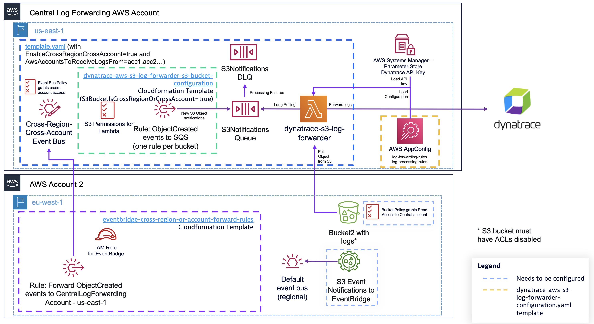

# Log Forwarding rules

The `dynatrace-aws-s3-log-forwarder` uses log forwarding rules to determine how to process log files. Log forwarding rules are stored in [AWS AppConfig](https://docs.aws.amazon.com/appconfig/latest/userguide/what-is-appconfig.html), a configuration manager system, from where the log processing AWS Lambda function pulls the configuration. This allows you to update your configuration at any point in time without requiring you to re-deploy the AWS Lambda function. Once a new configuration version is available, the log processing function will load it within ~1 minute.

The `dynatrace-aws-s3-log-forwarder-configuration.yaml` CloudFormation template, once deployed, defines an initial catch-all default rule. If you go to the AWS AppConfig [console](https://console.aws.amazon.com/systems-manager/appconfig/) you will find an `Application` named `<your_stack_name>-app-config` with two configuration profiles within it:

* log-forwarding-rules: stores log forwarding rules.
* log-processing-rules: stores custom log processing rules that you can optionally define. For more information, check the [log_processing.md](log_processing.md) documentation.

While the initial configuration helps you get started, you may want to configure more explicit and complex log processing rules.

## Configuring log forwarding rules

The anatomy of the `log-forwarding-rules` configuration profile is the following:

  ```yaml
  ---
  bucket_name: your_s3_bucket_1
  log_forwarding_rules:
    - name: Required[str]           # --> Name that identifies the rule
      prefix: Required[str]          # --> Regular expression that will be matched against each S3 Key name to determine whether the rule applies to it
      source: Required[str]          # --> valid values are 'aws', 'generic' or 'custom'
      source_name: Optional[str]     # --> this field is only required and used for 'custom' rules. 
      annotations: Optional[dict]    # --> contains user-defined key/value data to be added as attribute to the log entries
        key1: value
        key2: value
    - name: Required[str]       
      prefix: Required[str]     
      source: Required[str]     
      source_name: Optional[str]
      annotations: Optional[dict
        key1: value
        key2: value
  ---
  bucket_name: your_s3_bucket_2
  log_forwarding_rules:
    - name: Required[str]           
      prefix: Required[str]         
      source: Required[str]         
      source_name: Optional[str]    
      annotations: Optional[dict]   
        key1: value
        key2: value
  ```

If you define a rule set using `default` as bucket name, that rule set will be used for log objects from any S3 bucket that doesn't have explicit log forwarding rules set up.

Without a `default` rule, each Amazon S3 bucket from which you want to forward logs from to Dynatrace requires explicit log forwarding rules. If the Lambda function receives an S3 Object created notification and there are no explicit rules for the S3 bucket, or the object S3 Key doesn't match any of the prefix regular expressions defined on the rules for the bucket, the object is not forwarded to Dynatrace.

You can use explicit log forwarding rule sets for some buckets, and fallback to a default rule for other buckets; or simply delete the default rule, so only explicit rules are applied.

The prefix field allows you to define a regular expression to match against the S3 key name of your log objects to determine whether a rule applies to it or not. Rules are evaluated in order, meaning that if an S3 key matches multiple rules, the first rule that matches in the order they're defined will apply. If you want to define a generic rule that applies to any object within a bucket, you can use `'.*'` as prefix. Or you can define explicit rules, and a final rule with prefix `'.*'` that will apply to any objects that didn't match any prior rules.

Log forwarding rules allow you to add custom annotations to your logs (e.g team: x, environment: dev) as well as tell the log forwarding function how to process your AWS, application/3rd party logs: AWS-vended logs (source:aws), generic text logs (source: generic) or other logs that you've defined log processing rules for (source: custom). All forwarded logs are automatically annotated with the following context attributes:

* log.source.s3_bucket_name: name of the S3 bucket the log was forwarded from
* log.source.s3_key_name: key name of the S3 object that the log entry belongs to
* log.source.forwarder: the ARN of the AWS Lambda function that forwarded the log entry (this helps if you have multiple log forwarding instances running)

The `dynatrace-aws-s3-log-forwarder` automatically annotates logs and extracts relevant attributes for supported AWS services with fields like `aws.account.id`, `aws.region`... The following AWS-vended logs are supported:

* CloudTrail
* Application Load Balancer
* Network Load Balancer
* Classic Load Balancer

For any other logs you may want to ingest from S3, you can just ingest any text-based logs as `generic` logs (source: generic) and stream of JSON entries logs as `generic_json_stream` (source: generic, source_name: generic_json_stream). Then, you can [configure Dynatrace to process the logs at ingestion time](https://www.dynatrace.com/support/help/how-to-use-dynatrace/log-monitoring/acquire-log-data/log-processing) to enrich them or parse them at query time with [DQL](https://www.dynatrace.com/support/help/how-to-use-dynatrace/log-monitoring/acquire-log-data/log-processing/log-processing-commands). Optionally, you can do custom processing on the Lambda function (e.g. extract log entries from a list in a JSON key) defining your own log processing rules. For more information, visit the [log_processing](log_processing.md) documentation.

### Example log-forwarding-rules rule sets

Let's take as example an S3 bucket called `my_bucket` where we're consolisating logs from multiple sources:

* Amazon ELB and Amazon CloudTrail logs (log prefix format is pre-defined by AWS)
* Nginx access logs

The log-forwarding-rules set for the S3 bucket could look like the following:

```yaml
---
bucket_name: my_bucket
log_forwarding_rules:
  - name: fwd_ctral_and_elb_logs         
    prefix: "^AWSLogs/.*/(CloudTrail|elasticloadbalancing)/.*"      
    source: aws
    annotations:
      environment: dev
  - name: fwd_nginx_logs
    prefix: ^nginx/.*(\\.log)"
    source: generic
    annotations: 
      log.source: nginx
```
  
With the above configuration, any Cloudtrail and ELB logs will be shipped to Dynatrace parsed and with an added 'environment: dev' attribute. The second rule is telling the forwarder to forward any logs coming from S3 keys prefixed with `nginx/` and ending with `.log` as generic text logs and add an annotation `log.source`: `nginx`. With that, you can then use [Dynatrace log processing](https://www.dynatrace.com/support/help/how-to-use-dynatrace/log-monitoring/acquire-log-data/log-processing) and define a rule that parses any logs with the attribute log.source: nginx at ingest time.

## Forwarding large log files to Dynatrace

The `dynatrace-aws-s3-log-forwarder` solution is able to handle large log files as data is streamed in chunks from Amazon S3 as it's processed and forwarded to Dynatrace. Even if the solution is able to do this with very low memory footprint, allocating low memory to the function means also low CPU and bandwidth resources and your Lambda function execution may timeout while processing logs (the default configured Lambda execution timeout configuration is 300 seconds). For more information, refer to the AWS Lambda [documentation](https://docs.aws.amazon.com/lambda/latest/operatorguide/computing-power.html).

The SAM template deploys the forwarder with the following default parameters that you can modify to suit your needs:

* LambdaFunctionMemorySize: 256 MB  --> At 1,769 MB, a function has the equivalent of one vCPU (one vCPU-second of credits per second).
* MaximumLambdaConcurrency: 30  --> Maximum number of Lambda functions executing concurrently
* LambdaSQSMessageBatchSize: 4  --> Number of log messages processed per Lambda execution (for smaller files you can increase it, for very large files you can decrease it)
* LambdaMaximumExecutionTime: 300  --> Maximum execution time in seconds of the AWS Lambda function, you can increase this up to 900
* SQSVisibilityTimeout: 420  --> SQS message invisibility time once received. This value should be larger than the LambdaMaximumExecutionTime to avoid more than one Lambda function processing the same log file (note however that SQS provides at-least-once delivery)
* SQSLongPollingMaxSeconds: 20  --> Time to wait while polling the SQS queue for messages
* MaximumSQSMessageRetries: 2  --> Maximum number of times the forwarder retries processing a log file if it fails before sending the S3 Object created notification to the DLQ

## Forward logs from S3 buckets on different AWS regions

It's possible to centralize log forwarding from S3 buckets on different AWS regions on a `dynatrace-aws-s3-log-forwarder` deployment on a specific AWS region to avoid the overhead of deploying and managing multiple S3 log forwarders.

In this case, you will need to configure Amazon EventBridge rules on the AWS region where your S3 bucket is to forward S3 Object Created notifications fto a dedicated event bus on the AWS region where you have deployed the `dynatrace-aws-s3-log-forwarder`. Before proceeding, make sure you have deployed the `dynatrace-aws-s3-log-forwarder` setting the `EnableCrossRegionCrossAccountForwarding` parameter to "true", so a dedicated Event Bus is created to receive cross-region notifications. If you didn't set this parameter when you deployed the forwarder, you can simply re-deploy the SAM template enabling it.

```bash
sam deploy --parameter-overrides EnableCrossRegionCrossAccountForwarding=true
```

The diagram below showcases what needs to be deployed to enable cross-region log forwarding:


For each S3 bucket located in a different AWS region than where the log forwarder is, that you want to forward logs from to Dynatrace, follow the below steps:

1. Deploy the `eventbridge-cross-region-forward-rules.yaml` CloudFormation template on the region where your S3 bucket is. This template will deploy an Amazon EventBridge rule to forward S3 Object Created notifications for the bucket and optional prefixes defined, as well as a required IAM role for EventBridge to forward the notifications to the destination region.

  To deploy the template replace the placeholder values:

  ```bash
  export STACK_NAME=your_log_forwarder_stack_name
  export BUCKET_NAME=your_bucket_name_here
  export REGION=region_of_your_bucket
  ```

  Then, execute the following commands:

  ```bash
  export EVENT_BUS_ARN=$(aws cloudformation describe-stacks \
                                                --stack-name $STACK_NAME \
                                                --query 'Stacks[].Outputs[?OutputKey==`CrossRegionCrossAccountEventBus`].OutputValue' \
                                                --output text)
  if [ ! -z $EVENT_BUS_ARN ]
  then
    aws cloudformation deploy \
      --template-file eventbridge-cross-region-forward-rules.yaml \
      --stack-name dynatrace-aws-s3-log-forwarder-cross-region-notifications-$BUCKET_NAME \
      --parameter-overrides CrossRegionCrossAccountEventBusArn=$EVENT_BUS_ARN \
          LogsBucketName=$BUCKET_NAME \
      --capabilities CAPABILITY_IAM \
      --region $REGION
  else
    echo "ERROR, Event bus ARN not found in CloudFromation stack: $STACK_NAME. Confirm parameter CrossRegionCrossAccountEventBus is set to true"
  fi
  ```

  **NOTE:** You can limit log forwarding for specific S3 bucket prefixes (e.g. dev/) adding up to 10 LogBucketPrefix# optional parameters to the above command.

1. Once the above stack is deployed, go to your S3 bucket(s) and enable notifications via EventBridge following instructions [here](https://docs.aws.amazon.com/AmazonS3/latest/userguide/enable-event-notifications-eventbridge.html).

1. Last, deploy the `s3-log-forwarder-bucket-config-template.yaml` CloudFormation template on the AWS region where the `dynatrace-aws-s3-log-forwarder` is deployed. This template will deploy the required regional Amazon EventBridge rules to send the cross-region forwarded notifications to the S3 forwarder Amazon SQS queue, as well as grant IAM permissions to the AWS Lambda function to access your S3 bucket. Make sure the `S3BucketIsCrossRegionOrCrossAccount` parameter is set to "true".

      ```bash
      aws cloudformation deploy \
        --template-file s3-log-forwarder-bucket-config-template.yaml \
        --stack-name dynatrace-aws-s3-log-forwarder-s3-bucket-configuration-$BUCKET_NAME \
        --parameter-overrides DynatraceAwsS3LogForwarderStackName=$STACK_NAME \
            LogsBucketName=$BUCKET_NAME \
            S3BucketIsCrossRegionOrCrossAccount=true \
        --capabilities CAPABILITY_IAM \
        --region <region-where-your-s3-log-forwarder-instance-is-deployed>
      ```

1. Define an explicit log-forwarding-rule for this S3 bucket on the log-forwarding-rules AWS AppConfig configuration profile and deploy it. Unless you have a default rule defined, logs from this bucket won't be forwarded until you deploy an explicit rule updating and deploying the `dynatrace-aws-s3-log-forwarder-configuration.yaml` CloudFormation stack.

**NOTE:** You'll incurr cross-region data transfer costs between the region where AWS Lambda forwarder function runs and the region where the S3 bucket is located, on top of data transfer between AWS Lambda and your Dynatrace tenant. For more detailed information, check the [AWS Pricing website](https://aws.amazon.com/ec2/pricing/on-demand/#Data_Transfer).

## Forward logs from S3 buckets on different AWS accounts

You can centralize log forwarding for logs in multiple AWS accounts and AWS regions on a single `dynatrace-aws-s3-log-forwarder` deployment to avoid the overhead of deploying and managing multiple log forwarding instances. Before proceeding, make sure you have deployed the `dynatrace-aws-s3-log-forwarder` setting the `EnableCrossRegionCrossAccountForwarding` parameter set to "true", so a dedicated Event Bus is created to receive cross-region notifications. If you didn't set this parameter, you can simply re-deploy the SAM template enabling it.

```bash
sam deploy --parameter-overrides EnableCrossRegionCrossAccountForwarding=true
```

The diagram below showcases what you need to deploy in order to have the `dynatrace-aws-s3-log-forwarder` forwarding logs from an S3 bucket in a different AWS:



For each S3 bucket located in a different AWS account that you want to forward logs from to Dynatrace, follow the below steps:

1. On the S3 bucket policy, add permissions to the IAM role of the S3 log forwarder to get logs from S3. Your bucket policy will look like this:

    ```yaml
    {
    "Version": "2012-10-17",
    "Statement": [
        {
            "Sid": "AllowDTS3LogFwderAccess",
            "Effect": "Allow",
            "Principal": {
                "AWS": "arn:aws:iam::<aws_account_id_where_the_log_forwarder_is>:role/<your_s3_log_forwarder_iam_role_name>"
            },
            "Action": [
                "s3:GetObject"
            ],
            "Resource": [
                "arn:aws:s3:::<bucket_name>/*"
            ]
        }
      ]
    }
    ```

    You can find the IAM Role ARN executing the following command on the AWS account where the log forwarder is deployed:

    ```bash
    export STACK_NAME=your_log_forwarder_stack_name_here

    aws cloudformation describe-stacks --stack-name $STACK_NAME \ 
                                                  --query 'Stacks[].Outputs[?OutputKey==`QueueProcessingFunctionIamRole`].OutputValue' \
                                                  --output text
    ```

    **IMPORTANT NOTE:** The S3 bucket on the source AWS account must be configured with [ACLs disabled](https://docs.aws.amazon.com/AmazonS3/latest/userguide/object-ownership-existing-bucket.html). If your S3 bucket has ACLs enabled, the above policy only takes effect for objects owned by the bucket owner. As AWS logs are delivered by AWS-owned accounts, who are the owners of the log objects, the permissions granted by the bucket policy don´t apply. Disabling ACLs should meet the wide majority of use cases (it's the default setting for S3 buckets created on the AWS console, and [will become default setting](https://aws.amazon.com/blogs/aws/heads-up-amazon-s3-security-changes-are-coming-in-april-of-2023/) starting on Apr 2023 for new buckets). If you have ACLs enabled on your bucket, read the [AWS documentation](https://docs.aws.amazon.com/AmazonS3/latest/userguide/object-ownership-existing-bucket.html) carefully before disabling them. The `dynatrace-aws-s3-log-forwarder` doesn't support accessing buckets assuming an IAM role on the destination account.

1. On the `{your-log-forwader-stack-name}-cross-region-cross-account-s3-events` Event Bus policy (on the AWS account and region where your log forwarder is deployed), grant permissions to the AWS account where your S3 bucket is to forward S3 Object created notifications. Follow the instructions [here](https://docs.aws.amazon.com/eventbridge/latest/userguide/eb-cross-account.html#eb-receiving-events-from-another-account). Your policy should look like the one below:

    ```json
    {
      "Version": "2012-10-17",
      "Statement": [
        {
      
          "Sid": "allow_account_to_put_events",
          "Effect": "Allow",
          "Principal": {
            "AWS": "<aws_account_id_where_the_s3_bucket_is>"
          },
          "Action": "events:PutEvents",
          "Resource": "arn:aws:events:<aws_region_where_the_forwarder_runs>:<aws_account_id_where_the_forwarder_runs>:event-bus/{your-log-forwader-stack-name}-cross-region-cross-account-s3-events"
        }
      ]
    }
    ```

    **NOTE:** If you have a large number of AWS accounts, you can permissions to all the AWS accounts in your AWS Organization with the aws:PrincipalOrgID condition:

    ```yaml
    {
      "Version": "2012-10-17",
      "Statement": [
        {
          "Sid": "allow_all_accounts_from_organization_to_put_events",
          "Effect": "Allow",
          "Principal": "*",
          "Action": "events:PutEvents",
          "Resource": "arn:aws:events:<aws_region_where_your_log_forwarder_is>:<aws_account_id_where_your_log_forwarder_is>:event-bus/{your-log-forwader-stack-name}-cross-region-cross-account-s3-events",
          "Condition": {
            "StringEquals": {
              "aws:PrincipalOrgID": "<ORGANIZATION_ID>"
              }
          }
        }  
      ]
    }  
    ````

1. On the AWS account where the S3 bucket is, [enable S3 notifications](https://docs.aws.amazon.com/AmazonS3/latest/userguide/enable-event-notifications-eventbridge.html) to Amazon EventBridge on the bucket.

1. Then create an EventBridge rule that forwards S3 Object Created notifications to the `{your-log-forwader-stack-name}-cross-region-cross-account-s3-events` event bus in the AWS account and region where the log forwarder is deployed.

  Replace the placeholder values below and execute the commands (the below commands assume you have configured [credential profiles](https://docs.aws.amazon.com/cli/latest/userguide/cli-configure-profiles.html) on your AWS CLI configuration for the different AWS accounts):

  ```bash
  export STACK_NAME=name_of_your_log_forwarder_stack
  export BUCKET_NAME=your_bucket_name
  export EVENT_BUS_ARN=$(aws cloudformation describe-stacks \
                                        --stack-name $STACK_NAME \
                                        --query 'Stacks[].Outputs[?OutputKey==`CrossRegionCrossAccountEventBus`].OutputValue' \
                                        --output text \
                                        --profile {aws_cli_credentials_profile_of_log_forwarder_aws_account})

  aws cloudformation deploy \
  --template-file eventbridge-cross-account-forward-rules.yaml \
  --stack-name dynatrace-aws-s3-log-forwarder-cross-account-notifications-$BUCKET_NAME \
  --parameter-overrides CrossRegionCrossAccountEventBusArn=$EVENT_BUS_ARN \
      LogsBucketName=$BUCKET_NAME \
  --capabilities CAPABILITY_IAM \
  --region {region_of_your_s3-bucket}
  --profile {aws_cli_credentials_profile_for_s3_bucket_aws_account}
  ```

1. Now, on the AWS account and region where the `dynatrace-aws-s3-log-forwarder` is running, deploy the `s3-log-forwarder-bucket-config-template.yaml` CloudFormation template to configure the local EventBridge rule to forward notifications to SQS for the log forwarder to pick them up. Make sure the `S3BucketIsCrossRegionOrCrossAccount` parameter is set to true.

    ```bash
    aws cloudformation deploy \
        --template-file s3-log-forwarder-bucket-config-template.yaml \
        --stack-name dynatrace-aws-s3-log-forwarder-s3-bucket-configuration-$BUCKET_NAME \
        --parameter-overrides DynatraceAwsS3LogForwarderStackName=$STACK_NAME \
            LogsBucketName=$BUCKET_NAME \
            S3BucketIsCrossRegionOrCrossAccount=true \
        --capabilities CAPABILITY_IAM \
        --profile {aws_cli_credentials_profile_of_log_forwarder_aws_account}
    ```

1. Define an explicit log-forwarding-rule for this S3 bucket on the log-forwarding-rules AWS AppConfig configuration profile and deploy it. Unless you have a default rule defined, logs from this bucket won't be forwarded until you deploy an explicit rule updating and deploying the `dynatrace-aws-s3-log-forwarder-configuration.yaml` CloudFormation stack.

## Forward logs to multiple Dynatrace tenants

**NOTE:** This feature is experimental and functionality might change in the future.

It is possible to send logs matching a single forwarding rule to multiple Dynatrace instances with the `sinks` attribute.

```yaml
- rule_name: fwd_ctral_and_elb_logs
  # Match any CloudTrail and ELB logs for any AWS account in this bucket
  prefix: "^AWSLogs/.*/(CloudTrail|elasticloadbalancing)/.*"
  source: aws
  sinks: 
    - '1'
    - '2'
  annotations: 
    environment: dev
```

The sink attribute contains a list of sink ids to forward logs to, each representing a Dynatrace instance. The template allows you to configure forwarding to up to 2 Dynatrace instances, although you can extend it for more (visit the [extending_sam_template](extending_sam_template.md) docs). The configuration for each Dynatrace instance is passed to the log forwarding Lambda function with 2 environment variables:

* DYNATRACE_{sink_id}_ENV_URL
* DYNATRACE_{sink_id}_API_KEY_PARAM

Please ensure that the SSM parameter identified by DYNATRACE_{sink_id}_API_KEY_PARAM exists (refer to section Deploy the solution).

For simplicity, the SAM template uses numeric {sink_id} identifiers (i.e. `DYNATRACE_1_ENV_URL`/`DYNATRACE_1_API_KEY_PARAM` and `DYNATRACE_2_ENV_URL`/`DYNATRACE_2_API_KEY_PARAM`), but you can use a string too to provide more meaningful identifiers. If you decide to use string identifiers though, you'll have to specify the `sinks` attribute on all the forwarding rules, since the default value when the attribute is not present is `1`.